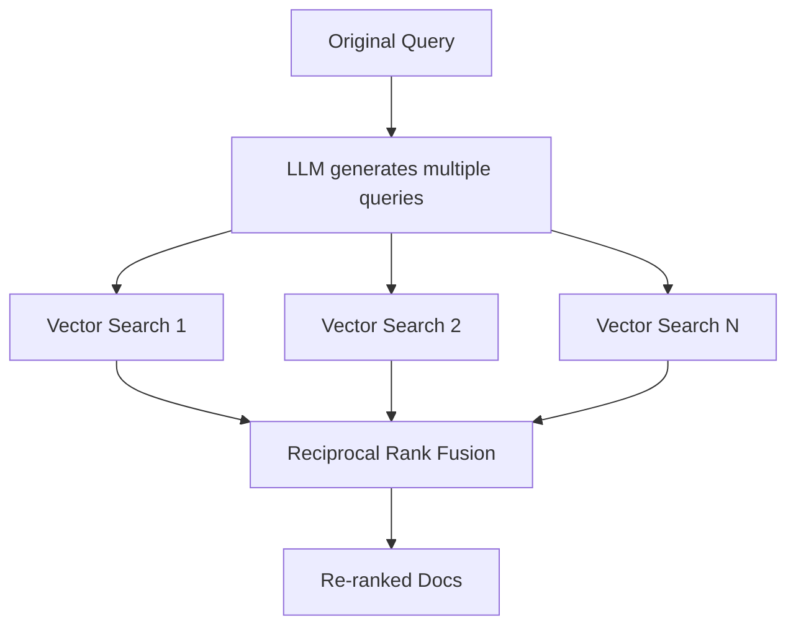

# RAG-Fusion: The Next Frontier of Search Technology

## Overview

RAG-Fusion is a search methodology that aims to bridge the gap between traditional search paradigms and the multifaceted dimensions of human queries. Where Retrieval Augmented Generation (RAG) fuses vector search with generative models, RAG-Fusion goes a step further — employing multiple query generation and Reciprocal Rank Fusion to re-rank search results. The aim is to surface relevant material a single phrasing of the query would miss, particularly when the user's vocabulary doesn't match how the corpus is indexed.

For the full story behind the approach, see the article: [Forget RAG, the Future is RAG-Fusion](https://adrianraudaschl.com/blog/forget-rag-the-future-is-rag-fusion/).

> **Where this technique fits, in one line:** Properly-configured RAG-Fusion (`hybrid_diverse+rerank`: BM25 + vector × LLM rewrites, fused via RRF, then cross-encoder reranked) produces measurably better retrieval rankings *and* better generated answers than baseline retrieval — at proper sample sizes with confidence intervals, on every difficulty bucket, even with a strong reranker. **The vector-only fusion variant is a different story** — it's roughly a wash on average and net-negative on rich queries at the answer level. If you deploy fusion, deploy the hybrid variant.
>
> Detailed empirical writeup — n=200 paired-bootstrap CIs, three rerankers, six fusion variants, end-to-end LLM-judge answer eval, including a replication of arXiv [2603.02153v1](https://arxiv.org/html/2603.02153v1) — lives in [`experiments/arxiv-2603-02153-replication/`](./experiments/arxiv-2603-02153-replication/README.md).

## How It Works



1. **Query Generation** — Takes a user's query and uses OpenAI's GPT to generate multiple search query variations that capture different facets of the original intent.

2. **Vector Search** — Conducts vector-based searches using ChromaDB on each query, casting a wider net across the document space.

3. **Reciprocal Rank Fusion** — Combines the ranked results from all searches, boosting documents that appear consistently across multiple query perspectives.

4. **Output Generation** — Produces a final re-ranked list of documents, optionally synthesised into a natural language answer via LLM.

## When to use RAG-Fusion

The technique earns its compute when three conditions hold:

1. **Terminology mismatch between user queries and indexed text** (lay vs technical names, jargon, paraphrase).
2. **Recall matters more than precision** — missing a relevant document is more costly than including a marginal one.
3. **The downstream consumer can handle topically-broad context** — either a strong synthesis LLM, or a UI that surfaces multiple candidates rather than one canonical answer.

Strong-fit examples:
- Academic / scientific literature search, biomedical research
- Patent prior-art search, legal e-discovery, regulatory review
- Long-tail e-commerce ("phone holder thing for car" → "magnetic vent mount")
- Cold-start retrieval over specialist corpora the embedding model hasn't seen
- Exploratory / "show me what's out there" workflows

Poor-fit examples:
- FAQ chatbots and curated customer-support knowledge bases
- Latency-critical retrieval (voice, autocomplete, sub-second-p95 chat)
- High-volume / margin-thin consumer search
- Code or identifier search (precision-dominated)
- Structured data, knowledge graphs, SQL-backed retrieval

For mixed workloads — most production retrieval — the right pattern is **adaptive routing**: run baseline+rerank on every query, fire fusion only when a cheap weakness signal trips. This captures the long-tail wins, eliminates the regression cases on easy queries, and pays for fusion's compute only on traffic where it earns it. See [`experiments/arxiv-2603-02153-replication/`](./experiments/arxiv-2603-02153-replication/README.md) for the data behind these recommendations, including cost and latency analysis across corpus sizes and data types.

## Project Structure

```
├── main.py                 # Core RAG-Fusion pipeline
├── evaluate.py             # Evaluation CLI (baseline + fusion variants, optional --rerank)
├── test_main.py            # Unit tests
├── eval/
│   ├── dataset.py          # NFCorpus download & loading
│   ├── metrics.py          # IR metrics (Precision, Recall, NDCG, MRR)
│   ├── retrieval.py        # Retrieval methods (BM25, vector, hybrid, RAG-Fusion variants)
│   ├── rerank.py           # Cross-encoder reranking stage
│   ├── query_cache.py      # Disk-persisted cache for LLM query rewrites
│   ├── sweep.py            # Pool-size and N-rewrites sweep driver
│   ├── steelman.py         # Pipeline-ordering / truncation / difficulty tests
│   ├── qualitative.py      # End-to-end answer-quality verbose log driver
│   ├── answer_eval.py      # LLM-judge end-to-end answer eval driver
│   ├── bootstrap_ci.py     # Paired-bootstrap CIs for steelman per-query metrics
│   ├── saved_queries.py    # "Saved queries" metric (kohlrabi-class binary recovery)
│   └── eval_with_ci.py     # Retrieval-only headline table with paired-bootstrap CIs
├── experiments/
│   └── arxiv-2603-02153-replication/  # Full replication writeup + raw results
└── .env.example            # Environment template
```

## Getting Started

1. Install dependencies:
   ```bash
   pip install openai chromadb python-dotenv tqdm tabulate rank_bm25
   ```

2. Set up your OpenAI API key:
   ```bash
   cp .env.example .env
   ```
   Then edit `.env` and replace `your-key-here` with your actual key.

3. Run the demo:
   ```bash
   python main.py
   ```

4. Run the tests (no API key needed):
   ```bash
   python -m pytest test_main.py -v
   ```

## Evaluation

To move beyond toy examples, the repo includes a quantitative evaluation harness that compares multiple retrieval strategies on a real dataset. It uses [NFCorpus](https://www.cl.uni-heidelberg.de/statnlpgroup/nfcorpus/) (3,633 medical/nutrition documents, 323 test queries with graded relevance judgments) from the [BEIR benchmark](https://github.com/beir-cellar/beir).

### Retrieval-only results (n=200, paired-bootstrap 95% CIs)

The table below is **retrieval-only** — no cross-encoder reranking, no end-to-end answer-quality eval. It's intended as a quick visual of how the fusion variants stack up in their pure retrieval form. For the production-relevant comparison (with cross-encoder rerank, hybrid variants, LLM-judge answer quality, and operational analysis by cost / latency / corpus / data type), see [`experiments/arxiv-2603-02153-replication/`](./experiments/arxiv-2603-02153-replication/README.md). Lifts in the rightmost column are bolded when the 95% CI excludes zero.

| Metric    | k  | BM25  | Baseline | Hybrid | RAG-Fusion | +Diverse | Hybrid+Diverse | Hybrid+Diverse lift over Baseline [95% CI] |
|-----------|----|-------|----------|--------|------------|----------|----------------|---------------------------------------------|
| Precision | 5  | 0.255 | 0.283    | 0.272  | 0.302      | 0.307    | **0.324**      | **+0.041 [+0.020, +0.062]**                 |
| Precision | 10 | 0.185 | 0.228    | 0.218  | 0.239      | 0.246    | **0.258**      | **+0.030 [+0.016, +0.044]**                 |
| Precision | 20 | 0.131 | 0.168    | 0.168  | 0.180      | 0.186    | **0.194**      | **+0.026 [+0.017, +0.035]**                 |
| Recall    | 5  | 0.110 | 0.117    | 0.116  | 0.122      | 0.129    | **0.141**      | **+0.024 [+0.004, +0.045]**                 |
| Recall    | 10 | 0.130 | 0.151    | 0.155  | 0.165      | 0.168    | **0.185**      | **+0.034 [+0.018, +0.053]**                 |
| Recall    | 20 | 0.147 | 0.188    | 0.192  | 0.205      | 0.203    | **0.219**      | **+0.032 [+0.019, +0.047]**                 |
| NDCG      | 5  | 0.295 | 0.321    | 0.322  | 0.337      | 0.344    | **0.383**      | **+0.062 [+0.037, +0.087]**                 |
| NDCG      | 10 | 0.262 | 0.301    | 0.302  | 0.319      | 0.322    | **0.357**      | **+0.057 [+0.038, +0.077]**                 |
| NDCG      | 20 | 0.242 | 0.286    | 0.291  | 0.305      | 0.309    | **0.340**      | **+0.055 [+0.039, +0.071]**                 |
| MRR       | -  | 0.461 | 0.488    | 0.513  | 0.504      | 0.505    | **0.577**      | **+0.089 [+0.051, +0.128]**                 |

Six methods compared:

- **BM25** — classic keyword search using BM25Okapi. Competitive on small-K precision thanks to exact term matching on NFCorpus's medical vocabulary, but falls behind at higher k values where semantic understanding matters more.
- **Baseline** — single vector search with the original query using ChromaDB's default embedding model (`all-MiniLM-L6-v2`).
- **Hybrid** — BM25 + vector search fused via RRF (no LLM calls). A strong "free lunch" — runs as fast as baseline with no API costs, and notably improves MRR over Baseline.
- **RAG-Fusion** — original + 4 LLM-generated queries, combined via Reciprocal Rank Fusion.
- **RAG-Fusion +Diverse** — RAG-Fusion with an improved prompt that explicitly asks for different angles, synonyms, and varied specificity. Modest improvement over standard RAG-Fusion at this sample size.
- **Hybrid+Diverse** — the best of both: runs RAG-Fusion (diverse prompt) but searches each query with both BM25 and vector search, then fuses all results via RRF. Best overall performer with **+19% NDCG@10** and **+18% MRR** over baseline, 95% CIs excluding zero on every metric.

Three insights emerge that survive proper sample sizes and CIs. First, **hybrid search is a free lunch** — fusing BM25 and vector results via RRF costs nothing extra and improves ranking quality, especially at the top of the ranking. Second, the **diverse prompt** modestly outperforms the standard RAG-Fusion prompt by pushing the LLM toward genuinely different angles. Third, **the two techniques are complementary** — hybrid's keyword precision and diverse's semantic breadth combine through RRF for the strongest retrieval-only result.

> **Caveat: retrieval ≠ production.** Real RAG stacks add a cross-encoder reranking stage after retrieval and care about the quality of the *generated answer*, not just the ranking. When we add reranking and run end-to-end LLM-judge evaluation at n=200, the lifts shrink (`hybrid_diverse+rerank` over a vector baseline+rerank: NDCG@10 +0.021 [+0.007, +0.036], LLM-judge mean score +0.10) but stay statistically significant. The vector-only fusion variants (RAG-Fusion, +Diverse) collapse toward zero once a strong reranker is added. **Don't deploy on the basis of this retrieval-only table alone — the [experiments/arxiv-2603-02153-replication/](./experiments/arxiv-2603-02153-replication/README.md) writeup is the production-relevant version.**

```bash
# Production-style comparison: candidate pool of 50, then reranked + truncated
python evaluate.py --sample 200 --rerank --candidate-pool 50 \
  --methods baseline hybrid rag-fusion rag-fusion-diverse hybrid-diverse

# Re-run this retrieval-only headline table with bootstrap CIs
python -m eval.eval_with_ci --sample 200
```

### Running the evaluation

```bash
# Baseline only (no API key needed)
python evaluate.py --sample 10 --methods baseline

# Default comparison (requires OPENAI_API_KEY)
python evaluate.py --sample 50

# All methods
python evaluate.py --sample 50 --methods bm25 baseline hybrid rag-fusion rag-fusion-diverse hybrid-diverse

# Custom parameters
python evaluate.py --sample 100 --k 5 10 --data-dir ./datasets
```

The NFCorpus dataset (~3MB) is downloaded automatically on first run. ChromaDB embeddings are persisted locally so subsequent runs skip ingestion.