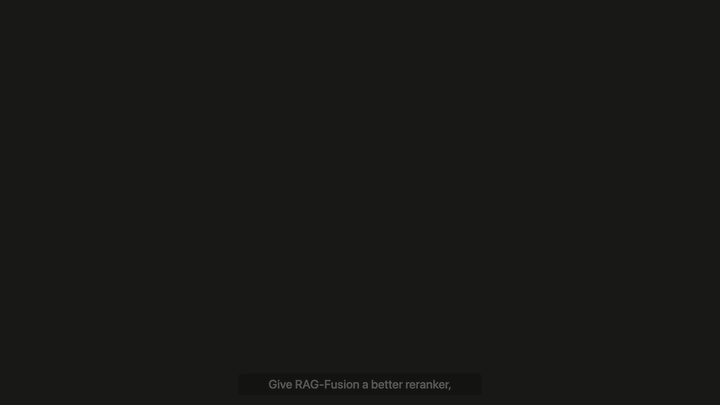
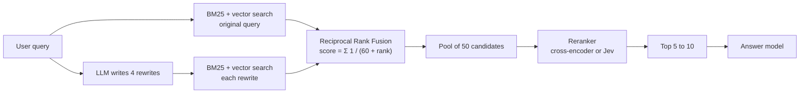

# RAG-Fusion: The Next Frontier of Search Technology

<a href="https://youtu.be/SzfGTXWZf4o"></a>

▶ **[Watch the video: *Jev as a reranker doubled RAG-Fusion's lift*](https://youtu.be/SzfGTXWZf4o)** (4.5 minutes, narrated and captioned). The write-up behind it is in [`experiments/jev-in-the-pipeline/`](./experiments/jev-in-the-pipeline/README.md).

## Overview

RAG-Fusion is a search methodology that aims to bridge the gap between traditional search paradigms and the multifaceted dimensions of human queries. Where Retrieval Augmented Generation (RAG) fuses vector search with generative models, RAG-Fusion goes a step further — employing multiple query generation and Reciprocal Rank Fusion to re-rank search results. The aim is to surface relevant material a single phrasing of the query would miss, particularly when the user's vocabulary doesn't match how the corpus is indexed.

For the full story behind the approach, see the article: [Forget RAG, the Future is RAG-Fusion](https://adrianraudaschl.com/blog/forget-rag-the-future-is-rag-fusion/).

> **Where this technique fits, in one line:** Properly configured RAG-Fusion (`hybrid_diverse+rerank`: BM25 + vector for the original query and LLM rewrites, fused via RRF, then reranked) reliably improves retrieval after reranking, on every reranker tested, and most of all with the strongest one: +0.025 NDCG@10 with `bge-reranker-large`, +0.050 with Jev (n=200, 95% CIs excluding zero). Its effect on the generated answer is positive but noisy: fusion won more LLM-judge comparisons than it lost in all three judge runs, and significantly in two. The vector-only fusion variant is roughly a wash once a reranker is added. If you deploy fusion, deploy the hybrid variant and put your strongest reranker behind it.
>
> Write-ups:
> - [`experiments/jev-in-the-pipeline/`](./experiments/jev-in-the-pipeline/README.md) (September 2026): four rerankers including Jev, a decision model from TypeSafe; cost and latency per configuration; three ways of putting Jev inside fusion; a narrated explainer video; and a rewrite-parser bug found and fixed along the way.
> - [`experiments/arxiv-2603-02153-replication/`](./experiments/arxiv-2603-02153-replication/README.md) (April 2026): the replication of arXiv [2603.02153v1](https://arxiv.org/html/2603.02153v1), with a correction note for the parser bug.

## How It Works


```mermaid
flowchart LR
    Q["User query"] --> RW["LLM writes 4 rewrites"]
    Q --> S0["BM25 + vector search<br/>original query"]
    RW --> S1["BM25 + vector search<br/>each rewrite"]
    S0 --> RRF["Reciprocal Rank Fusion<br/>score = Σ 1 / (60 + rank)"]
    S1 --> RRF
    RRF --> P["Pool of 50 candidates"]
    P --> RR["Reranker<br/>cross-encoder or Jev"]
    RR --> T["Top 5 to 10"]
    T --> A["Answer model"]
```

1. **Query generation:** an LLM writes several rewrites of the user's query that come at it from different angles (synonyms, narrower and broader framings, related sub-topics).
2. **Hybrid search:** the original query and every rewrite are searched twice, with BM25 (keywords) and with vector search, which gives ten ranked lists for four rewrites.
3. **Reciprocal Rank Fusion:** the lists are merged, and each document scores 1 / (60 + rank) summed over every list it appears in, so documents that keep turning up rise.
4. **Rerank:** a reranker (a cross-encoder, or a decision model such as Jev) re-scores the fused pool, and only the top results reach the model that writes the answer.

The original version of the technique used vector search only and no reranker, and that's what `main.py` still demonstrates. The hybrid-plus-rerank configuration above is what the experiments in this repo found works; its code is in `eval/`.

## When to use RAG-Fusion

The technique earns its compute when three conditions hold:

1. **Terminology mismatch between user queries and indexed text** (lay vs technical names, jargon, paraphrase).
2. **Recall matters more than precision** — missing a relevant document is more costly than including a marginal one.
3. **The downstream consumer can handle topically-broad context** — either a strong synthesis LLM, or a UI that surfaces multiple candidates rather than one canonical answer.

Strong-fit examples:
- Academic / scientific literature search, biomedical research
- Patent prior-art search, legal e-discovery, regulatory review
- Long-tail e-commerce ("phone holder thing for car" → "magnetic vent mount")
- Cold-start retrieval over specialist corpora the embedding model hasn't seen
- Exploratory / "show me what's out there" workflows

Poor-fit examples:
- FAQ chatbots and curated customer-support knowledge bases
- Latency-critical retrieval (voice, autocomplete, sub-second-p95 chat)
- High-volume / margin-thin consumer search
- Code or identifier search (precision-dominated)
- Structured data, knowledge graphs, SQL-backed retrieval

What fusion costs is mostly latency, not money. With a small rewrite model the rewrite call is about $0.06 per 1,000 queries but adds about 1.5 seconds before the extra searches can run. Adding BM25 to vector search (hybrid, no rewrites) is close to free and worth doing everywhere. Measurements per configuration are in [`experiments/jev-in-the-pipeline/`](./experiments/jev-in-the-pipeline/README.md#6-what-each-option-costs).

For mixed workloads, routing is the obvious idea: run hybrid+rerank on every query and fire the rewrites only where they're likely to pay. It's still unproven here. The one router tested so far (Jev classifying each query's type) fused 78% of queries, saved about a fifth of the rewrite calls at no measurable cost, and didn't target the queries where fusion helps. A router keyed on a retrieval-weakness signal, such as a low top reranker score, is the next thing to test.

## Project Structure

```
├── main.py                 # Core RAG-Fusion pipeline
├── evaluate.py             # Evaluation CLI (baseline + fusion variants, optional --rerank)
├── test_main.py            # Unit tests
├── eval/
│   ├── dataset.py          # NFCorpus download & loading
│   ├── metrics.py          # IR metrics (Precision, Recall, NDCG, MRR)
│   ├── retrieval.py        # Retrieval methods (BM25, vector, hybrid, RAG-Fusion variants)
│   ├── rerank.py           # Reranking stage: cross-encoders, FlashRank, or Jev
│   ├── query_cache.py      # Disk-persisted cache for LLM query rewrites
│   ├── sweep.py            # Pool-size and N-rewrites sweep driver
│   ├── steelman.py         # Pipeline-ordering / truncation / difficulty tests
│   ├── qualitative.py      # End-to-end answer-quality verbose log driver
│   ├── answer_eval.py      # LLM-judge end-to-end answer eval driver
│   ├── bootstrap_ci.py     # Paired-bootstrap CIs for steelman per-query metrics
│   ├── saved_queries.py    # "Saved queries" metric (kohlrabi-class binary recovery)
│   ├── eval_with_ci.py     # Retrieval-only headline table with paired-bootstrap CIs
│   ├── jev.py              # Jev client: relevance, intent and query-type calls, cached per run
│   ├── jev_arms.py         # Jev inside fusion: intent-weighted RRF, query-type router, evidence gate
│   ├── latency_bench.py    # Per-piece latency and cost benchmark
│   └── pool_recall.py      # Relevant documents in the pool vs in each reranker's top 10
├── experiments/
│   ├── arxiv-2603-02153-replication/  # April replication write-up + all raw results
│   └── jev-in-the-pipeline/           # September write-up, benchmarks and explainer video
└── .env.example            # Environment template
```

## Getting Started

1. Install dependencies:
   ```bash
   pip install openai chromadb python-dotenv tqdm tabulate rank_bm25
   # optional, for the reranking experiments
   pip install sentence-transformers flashrank typesafe-sdk
   ```

2. Set up your OpenAI API key:
   ```bash
   cp .env.example .env
   ```
   Then edit `.env` and replace `your-key-here` with your actual key. `JEV_API_KEY` is only needed for the Jev experiments. The LLM used for rewrites, answers and judging defaults to `gpt-6-luna` at low reasoning effort; override it with `LLM_MODEL` and `LLM_REASONING_EFFORT`.

3. Run the demo:
   ```bash
   python main.py
   ```

4. Run the tests (no API key needed):
   ```bash
   python -m pytest test_main.py -v
   ```

## Evaluation

To move beyond toy examples, the repo includes a quantitative evaluation harness that compares multiple retrieval strategies on a real dataset. It uses [NFCorpus](https://www.cl.uni-heidelberg.de/statnlpgroup/nfcorpus/) (3,633 medical/nutrition documents, 323 test queries with graded relevance judgments) from the [BEIR benchmark](https://github.com/beir-cellar/beir).

### Retrieval-only results (n=200, paired-bootstrap 95% CIs)

> **Note (September 2026):** this table predates the fix for a rewrite-parser bug that, for about half the queries, fused a preamble line and an empty string as if they were rewrites. It can't be regenerated exactly, because the model that produced its rewrites has since been retired. The post-rerank numbers in both write-ups have been re-run with the fix; there, the bug turned out to have cost fusion slightly rather than flattered it.

The table below is **retrieval-only** — no cross-encoder reranking, no end-to-end answer-quality eval. It's intended as a quick visual of how the fusion variants stack up in their pure retrieval form. For the production-relevant comparison (with cross-encoder rerank, hybrid variants, LLM-judge answer quality, and operational analysis by cost / latency / corpus / data type), see [`experiments/arxiv-2603-02153-replication/`](./experiments/arxiv-2603-02153-replication/README.md). Lifts in the rightmost column are bolded when the 95% CI excludes zero.

| Metric    | k  | BM25  | Baseline | Hybrid | RAG-Fusion | +Diverse | Hybrid+Diverse | Hybrid+Diverse lift over Baseline [95% CI] |
|-----------|----|-------|----------|--------|------------|----------|----------------|---------------------------------------------|
| Precision | 5  | 0.255 | 0.283    | 0.272  | 0.302      | 0.307    | **0.324**      | **+0.041 [+0.020, +0.062]**                 |
| Precision | 10 | 0.185 | 0.228    | 0.218  | 0.239      | 0.246    | **0.258**      | **+0.030 [+0.016, +0.044]**                 |
| Precision | 20 | 0.131 | 0.168    | 0.168  | 0.180      | 0.186    | **0.194**      | **+0.026 [+0.017, +0.035]**                 |
| Recall    | 5  | 0.110 | 0.117    | 0.116  | 0.122      | 0.129    | **0.141**      | **+0.024 [+0.004, +0.045]**                 |
| Recall    | 10 | 0.130 | 0.151    | 0.155  | 0.165      | 0.168    | **0.185**      | **+0.034 [+0.018, +0.053]**                 |
| Recall    | 20 | 0.147 | 0.188    | 0.192  | 0.205      | 0.203    | **0.219**      | **+0.032 [+0.019, +0.047]**                 |
| NDCG      | 5  | 0.295 | 0.321    | 0.322  | 0.337      | 0.344    | **0.383**      | **+0.062 [+0.037, +0.087]**                 |
| NDCG      | 10 | 0.262 | 0.301    | 0.302  | 0.319      | 0.322    | **0.357**      | **+0.057 [+0.038, +0.077]**                 |
| NDCG      | 20 | 0.242 | 0.286    | 0.291  | 0.305      | 0.309    | **0.340**      | **+0.055 [+0.039, +0.071]**                 |
| MRR       | -  | 0.461 | 0.488    | 0.513  | 0.504      | 0.505    | **0.577**      | **+0.089 [+0.051, +0.128]**                 |

Six methods compared:

- **BM25** — classic keyword search using BM25Okapi. Competitive on small-K precision thanks to exact term matching on NFCorpus's medical vocabulary, but falls behind at higher k values where semantic understanding matters more.
- **Baseline** — single vector search with the original query using ChromaDB's default embedding model (`all-MiniLM-L6-v2`).
- **Hybrid** — BM25 + vector search fused via RRF (no LLM calls). A strong "free lunch" — runs as fast as baseline with no API costs, and notably improves MRR over Baseline.
- **RAG-Fusion** — original + 4 LLM-generated queries, combined via Reciprocal Rank Fusion.
- **RAG-Fusion +Diverse** — RAG-Fusion with an improved prompt that explicitly asks for different angles, synonyms, and varied specificity. Modest improvement over standard RAG-Fusion at this sample size.
- **Hybrid+Diverse** — the best of both: runs RAG-Fusion (diverse prompt) but searches each query with both BM25 and vector search, then fuses all results via RRF. Best overall performer with **+19% NDCG@10** and **+18% MRR** over baseline, 95% CIs excluding zero on every metric.

Three insights emerge that survive proper sample sizes and CIs. First, **hybrid search is a free lunch** — fusing BM25 and vector results via RRF costs nothing extra and improves ranking quality, especially at the top of the ranking. Second, the **diverse prompt** modestly outperforms the standard RAG-Fusion prompt by pushing the LLM toward genuinely different angles. Third, **the two techniques are complementary** — hybrid's keyword precision and diverse's semantic breadth combine through RRF for the strongest retrieval-only result.

> **Caveat: retrieval ≠ production.** Real RAG stacks add a cross-encoder reranking stage after retrieval and care about the quality of the *generated answer*, not just the ranking. When we add reranking, the lifts shrink but stay statistically significant (`hybrid_diverse+rerank` over a vector baseline+rerank at n=200, after the parser fix: NDCG@10 +0.025 [+0.012, +0.041] with `bge-reranker-large`, +0.050 [+0.032, +0.070] with Jev). End-to-end LLM-judge scores favour fusion in all three judge runs, but significantly in only two, so treat the answer-level effect as real but small and noisy. The vector-only fusion variants (RAG-Fusion, +Diverse) collapse toward zero once a strong reranker is added. **Don't deploy on the basis of this retrieval-only table alone — the [experiments/arxiv-2603-02153-replication/](./experiments/arxiv-2603-02153-replication/README.md) writeup is the production-relevant version.**

```bash
# Production-style comparison: candidate pool of 50, then reranked + truncated
python evaluate.py --sample 200 --rerank --candidate-pool 50 \
  --methods baseline hybrid rag-fusion rag-fusion-diverse hybrid-diverse

# Re-run this retrieval-only headline table with bootstrap CIs
python -m eval.eval_with_ci --sample 200
```

### Running the evaluation

```bash
# Baseline only (no API key needed)
python evaluate.py --sample 10 --methods baseline

# Default comparison (requires OPENAI_API_KEY)
python evaluate.py --sample 50

# All methods
python evaluate.py --sample 50 --methods bm25 baseline hybrid rag-fusion rag-fusion-diverse hybrid-diverse

# Custom parameters
python evaluate.py --sample 100 --k 5 10 --data-dir ./datasets
```

The NFCorpus dataset (~3MB) is downloaded automatically on first run. ChromaDB embeddings are persisted locally so subsequent runs skip ingestion.