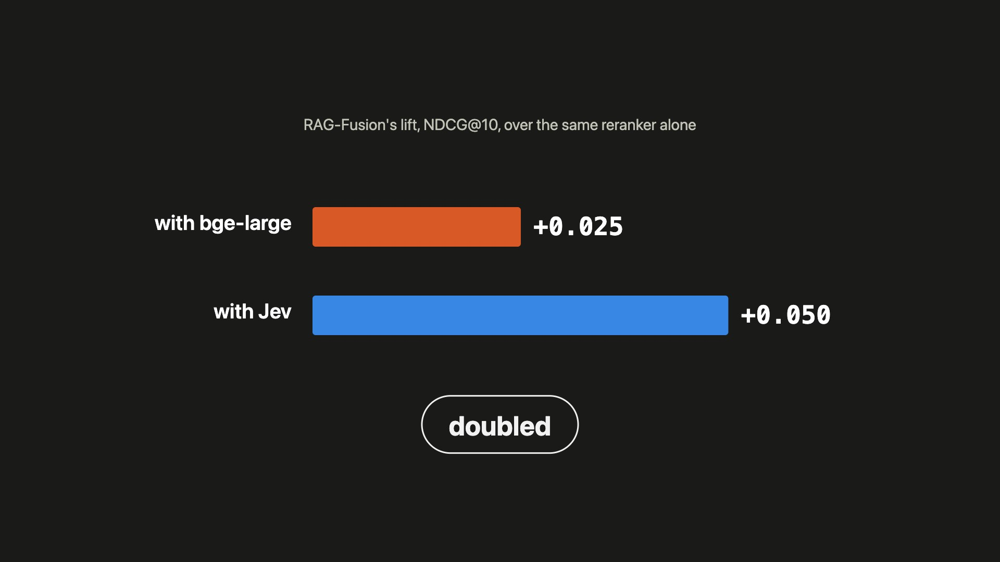
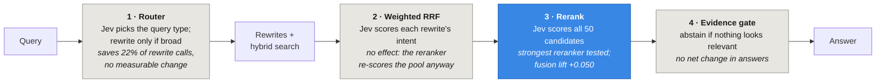
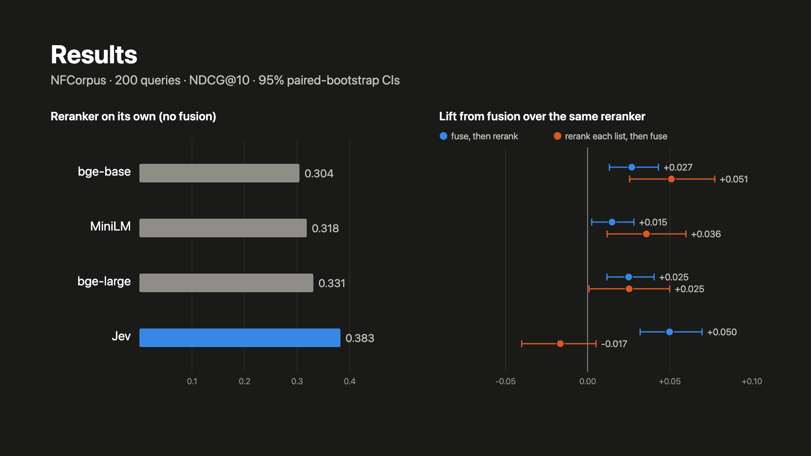
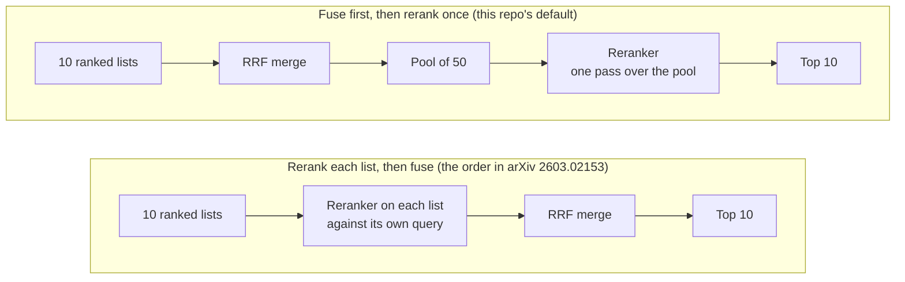
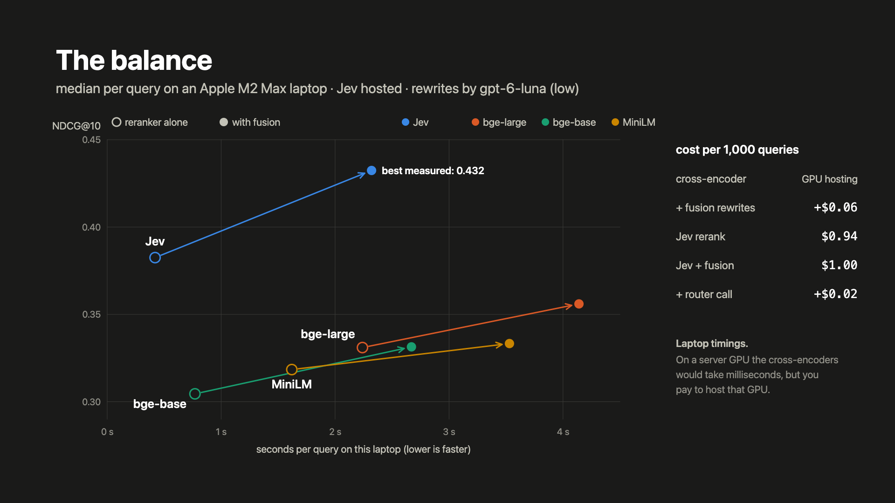
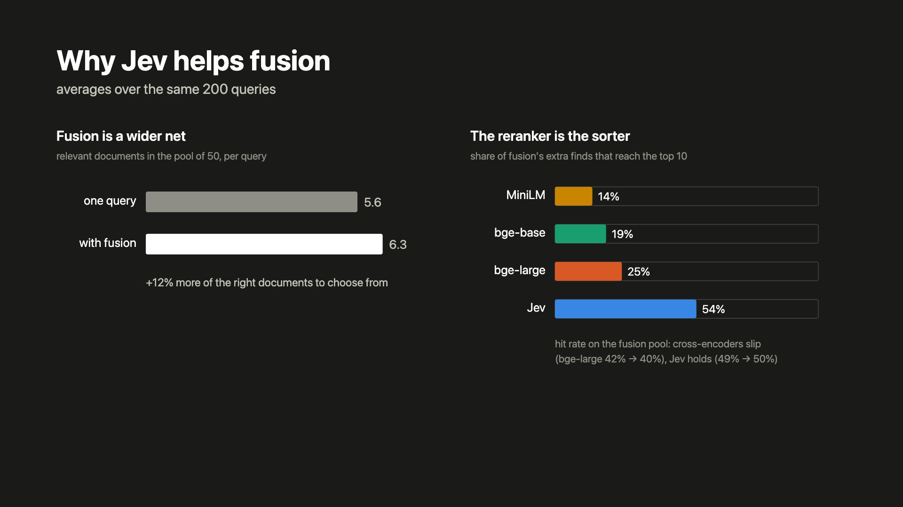

# Jev inside the RAG-Fusion pipeline

> **Data:** every JSON referenced here lives in [`../arxiv-2603-02153-replication/results/`](../arxiv-2603-02153-replication/results/), next to the April files it corrects. Files ending `_v2` are the parser-fixed re-runs; files with `jev` in the name are new.

[](https://youtu.be/SzfGTXWZf4o)

*A narrated walkthrough of how the four rerankers work, what they did here, what each option costs, and why Jev helps fusion. [Watch on YouTube](https://youtu.be/SzfGTXWZf4o), or download the [MP4](video/rankers-explainer.mp4) and [captions](video/rankers-explainer.srt) from this repo.*

<details>
<summary>How the video was made</summary>

Every frame is drawn by code: an SVG scene that's a pure function of time, stepped at 30 fps in headless Chrome and encoded with ffmpeg. There's no video-generation model and no stock footage. Every number on screen is read from the result files in this repo at build time, not typed in. The narration is synthesised speech (`openai/gpt-audio` via OpenRouter, voice "cedar"). Every line was transcribed back with two speech-to-text models to check it said what the script says, and one mispronounced line was re-recorded. The caption timings come from those transcriptions. The small sound effects are synthesised in numpy, and the mix is normalised to about -14 LUFS. The narration cost about $0.55 and the transcription a few cents. The build scripts aren't part of this repository.

</details>

**TL;DR.** I set out to test whether Jev, TypeSafe's decision model, improves RAG-Fusion at the points a reranker can't reach. I found a bug in my own harness on the way, fixed it, and re-ran April's replication before testing anything new. The retrieval conclusions from April survive the fix. Jev turns out to be the strongest reranker I've tested on NFCorpus, and fusion's lift roughly doubles under it (+0.050 NDCG@10, replicated across two runs), which is the opposite of what "stronger rerankers absorb fusion" predicts. The ideas that put Jev *inside* fusion did much less: intent-weighting the rewrites changed nothing measurable, a query-type router saved about a fifth of the rewrite calls at no detectable cost, and an evidence gate moved answer quality from rich queries to scarce ones without improving it overall. The answer-level evidence for fusion itself is weaker and noisier than I claimed in April.

Where Jev went into the pipeline, and what each placement did:



## Disclosure

Same as before: I wrote the original RAG-Fusion article and hold the patent, so weigh the framing accordingly. This round also found a mistake in my own code, which I've tried to report as plainly as the results.

## The bug first

The query-rewrite step asked the LLM for four queries and split the reply on newlines, then kept the first four lines. For 96 of the 200 cached queries the reply began with a preamble, so the "four rewrites" were actually:

```
['Here are 4 diverse search queries related to veal:', '', '1. nutritional value…', '2. humane veal production…']
```

That's two real rewrites, the preamble sentence, and an empty string. BM25 scores every document zero for an empty query, so it returns the same first *k* documents in the index every time, which quietly put a fixed set of junk candidates into half the pools. It also means April's N=1 "strict replication" used the preamble as its single rewrite for 48% of queries.

The fix is `parse_queries()` in `main.py` (drops preambles and blank lines, strips list markers), applied on read to the existing cache, so every re-run below uses **exactly the same LLM rewrites as April**, cleaned. The only thing that changed is the bug.

I also found that the April answer judge always saw the methods in the same positions (baseline first, hybrid_diverse last). The judge now shuffles which label each method gets per query and presents the answers in label order.

## Setup

Everything is unchanged from April unless stated: NFCorpus (BEIR), the same 200 sampled queries, a 50-document candidate pool, four LLM rewrites, top-5 context for answers, 95% paired-bootstrap CIs (B=10,000). "Rich" queries are those where the baseline already finds a relevant document in its top 10; "scarce" are the rest. Buckets are defined per reranker, so their sizes differ slightly.

| Component | What it is |
|---|---|
| Rerankers | FlashRank `ms-marco-MiniLM-L-12-v2` (33M), `BAAI/bge-reranker-base` (278M), `BAAI/bge-reranker-large` (560M), and **Jev** (`jev-latest` = `jev-1.13.0`, hosted) |
| Jev as a reranker | Query plus up to 30 documents in one call, one yes/no "is this relevant?" question per document, calibrated P(relevant) back. A pool of 50 is two calls. Same prompt as [hev/jev-rerank](https://github.com/hev/jev-rerank) |
| Rewrites | April's cached `gpt-5.1-chat-latest` rewrites, cleaned by the parser fix |
| Answer writer and judge | `gpt-6-luna`, reasoning effort low (April used `gpt-5.1-chat-latest`) |

## 1. The April retrieval result survives the fix

`hybrid_diverse+rerank` (BM25 + vector for the original query and four rewrites, RRF, then rerank) against the same reranker's single-query baseline, NDCG@10:

| Reranker | Baseline | Lift: all (n=200) | Lift: rich | Lift: scarce | April lift (with bug) |
|---|---|---|---|---|---|
| bge-base | 0.304 | **+0.027** [+0.013, +0.043] | **+0.024** [+0.010, +0.039] | **+0.034** [+0.007, +0.074] | +0.023 |
| MiniLM | 0.318 | **+0.015** [+0.002, +0.028] | +0.010 [-0.005, +0.026] | **+0.024** [+0.007, +0.049] | +0.014 |
| bge-large | 0.331 | **+0.025** [+0.012, +0.041] | **+0.022** [+0.007, +0.036] | **+0.033** [+0.006, +0.074] | +0.021 |
| **Jev, run 1** | **0.382** | **+0.050** [+0.032, +0.070] | **+0.039** [+0.021, +0.057] | **+0.077** [+0.035, +0.128] | n/a |
| **Jev, run 2** | **0.384** | **+0.052** [+0.035, +0.071] | **+0.044** [+0.026, +0.062] | **+0.073** [+0.033, +0.123] | n/a |

Bold = CI excludes zero. The bug was costing fusion a little, not flattering it; every lift went up slightly once the junk candidates were gone.

The paper's exact configuration (FlashRank, one rewrite, rerank each list then fuse) still shows no lift after the fix: +0.005 [-0.016, +0.027], against -0.011 in April. So the paper's finding holds for what they tested, now on clean data. Nothing lifts at N=1 with this reranker; `hybrid_diverse` goes from +0.001 at N=1 to +0.015 at N=4.

One oddity worth recording: baselines drifted by up to 0.003 against April (bge-large 0.334 to 0.331) on a code path the fix doesn't touch. I suspect accelerator numerics or library versions. It's well inside the noise but it's there.

## 2. Jev is the strongest reranker, and fusion gains more under it



On the same candidate pools, Jev beats bge-large by about 0.05 NDCG@10 on its own. NFCorpus abstracts are short (median 237 words), so the 512-token truncation of the cross-encoders explains little of that gap.

The more interesting number is the lift. If a stronger reranker absorbed fusion's gains, the strongest one should show the smallest lift. It shows the largest, on both rich and scarce queries, and it replicated almost exactly across two independent runs of a model that isn't deterministic. The mechanism shows up if you count documents rather than scores (`eval/pool_recall.py`, output in [`pool_recall.json`](./pool_recall.json)). Fusion puts 12% more relevant documents into the 50-document pool, 6.3 per query against 5.6 from a single query. What the reranker does with those extra 0.67 differs a lot:

| Reranker | Relevant in top 10, alone | With fusion | Gain | Share of fusion's extra finds reaching the top 10 | Hit rate on the pool, alone to fusion |
|---|---|---|---|---|---|
| MiniLM | 2.27 | 2.37 | +0.10 | 14% | 40% to 38% |
| bge-base | 2.20 | 2.33 | +0.13 | 19% | 39% to 37% |
| bge-large | 2.38 | 2.55 | +0.17 | 25% | 42% to 40% |
| Jev (run 1 / run 2) | 2.77 | 3.13 / 3.17 | +0.36 / +0.40 | 54% / 60% | 49% to 50% |

The last column is the telling one. Every cross-encoder gets slightly worse at picking relevant documents out of the fusion pool than out of a single-query pool; Jev doesn't. My guess is that fusion's extra finds are the harder cases, documents that came in through a rewrite and don't share much wording with the original query, and that a model reading the query and the document as a yes/no question copes with them better than one scoring surface similarity. That last part is interpretation, not something I measured directly. On rich queries the gain shows up in NDCG and recall but not MRR (+0.007), so it's coming from ranks 2 to 10, not the first result.

How much Jev moves between runs: across 46,360 document scores from 2,504 identical calls, 48% changed at all, the mean absolute change was 0.008, 95% moved by 0.03 or less, and the largest single move was 0.14. For sorting that barely matters; for a hard threshold it occasionally does.

## 3. Where the reranker sits depends on how good it is



April's results on pipeline order were mixed, and now I think I know why. Here is the lift from the hybrid "rerank each list, then fuse" ordering, against fuse-then-rerank, with rerankers sorted by strength:

| Reranker (baseline) | Fuse, then rerank once | Rerank each list, then fuse |
|---|---|---|
| bge-base (0.304) | +0.027 | **+0.051** [+0.025, +0.077] |
| MiniLM (0.318) | +0.015 | **+0.036** [+0.012, +0.060] |
| bge-large (0.331) | +0.025 | **+0.025** [+0.001, +0.050] |
| Jev (0.382 / 0.384) | **+0.050 / +0.052** | -0.017 / -0.019 (n.s.) |

Reranking each list first helps a lot with a weak reranker and stops helping with a strong one, monotonically across all four. Here's a speculation about the mechanism: a weak reranker makes noisy calls, and fusing ten separately reranked lists averages its mistakes away; a strong reranker's single judgement over the whole pool beats a vote among its judgements against individual rewrites, some of which have drifted from what the user asked. Four rerankers on one corpus is suggestive rather than conclusive, but it does explain why "which order is better?" never had a stable answer.

## 4. Jev inside fusion: two ideas that didn't pay

Both tested with bge-large reranking, two independent Jev runs each.

**Intent-weighted fusion.** One Jev call scores each rewrite for "does this keep the user's intent?", and RRF weights each rewrite's lists by that probability (the original query always keeps weight 1.0). Jev did discriminate: weights averaged 0.73, 11% fell below 0.5, and they ranged from 0.24 to 0.97. The lowest went to exactly the rewrites you'd want down-weighted ("Arkansas real estate trends and housing market analysis" at 0.29, "how to grow and harvest Stevia rebaudiana at home" at 0.32), and rewrites about growing, cooking, history or property made up 41% of those below 0.5 against 15% overall. It made no difference at all:

| Paired difference, NDCG@10 | Run 1 | Run 2 |
|---|---|---|
| Jev-weighted minus unweighted | -0.0002 [-0.0022, +0.0015] | +0.0006 [-0.0017, +0.0027] |
| Static 3x original-query weight minus unweighted | 0.0000 [-0.0057, +0.0055] | -0.0002 [-0.0059, +0.0054] |

The static control is just as flat, which points at the mechanism rather than at Jev. In a fuse-then-rerank pipeline, RRF weights only decide which documents make the 50-document pool, and the reranker then re-scores everything in it from scratch. Weighting matters only at the pool boundary, and almost nothing lives there. It could matter in a pipeline without a reranker, or with a much smaller pool; it can't matter here.

**Routing on query type.** Jev classifies each query as navigational, specific, broad or multi-faceted, and fusion runs only on broad or multi-faceted ones. I expected it to skip NFCorpus's short topic queries ("kohlrabi", "veal"), which is where a lot of fusion's wins are. It didn't: it called 153 of 200 queries broad and fused 78% of them. Lift fell from +0.025 to +0.024, a paired difference of -0.0017 [-0.0072, +0.0037], identical across runs, with only 3 of 200 routing decisions flipping between them. So it saves about 22% of the rewrite calls at no detectable cost, but it isn't really *targeting* anything: it fused 77% of rich queries and 79% of scarce ones. A router that knew where fusion pays would need a different signal.

## 5. Answer quality, and the evidence gate

This is where I have to walk something back. April's write-up said fusion "produces measurably better answers, not just better rankings", on the strength of 25 wins to 11 losses from an LLM judge. Here is that comparison across all three judge runs I now have:

| hybrid_diverse vs baseline (bge-large) | Answers and judge | Win / tie / loss | Mean score change [95% CI] | Sign test |
|---|---|---|---|---|
| April (with bug, fixed positions) | gpt-5.1-chat-latest | 25 / 164 / 11 | +0.09 [-0.01, +0.19] | p = 0.029 |
| Re-run A (3 answers per judgement) | gpt-6-luna | 32 / 146 / 22 | +0.035 [-0.065, +0.135] | p = 0.22 |
| Re-run C (4 answers per judgement) | gpt-6-luna | 35 / 148 / 17 | **+0.110** [+0.005, +0.215] | p = 0.018 |

Fusion wins more than it loses in all three, and the mean score change is positive in all three. It's significant in two of them, and the difference between A and C, which share the same retrievals and models, is as large as the effect itself. I don't think a single judge run at n=200 can settle this question, and I shouldn't have written April's sentence off one. Position bias isn't the explanation, for what it's worth: with shuffled labels, average scores by position are flat (1.30, 1.27, 1.28).

**The evidence gate** withholds context when Jev scores every top-5 document below 0.5, so the answer says the evidence is insufficient. It fired on 36 queries (27 of 60 scarce, 9 of 140 rich) and left the overall mean exactly where it was (1.35 against 1.35). It helped scarce queries (1.28 against 1.15) and hurt rich ones (1.38 against 1.44). On the 36 queries where it fired, gated answers scored better 14 times, worse 11 and the same 11.

Two things make me doubt the gate would do better with tuning. Where Jev's top relevance was below 0.3, the ungated answers actually averaged 1.87, well above the overall mean, so "Jev sees nothing relevant" isn't identifying bad answers on this corpus. And the judge grades abstentions inconsistently, anywhere from 0 to 3 for the same "insufficient evidence" answer, because it scores against a single gold document. Measuring "knowing when there's nothing to find" needs a dataset with unanswerable queries labelled as such, which NFCorpus isn't.

Intent-weighted fusion scored 1.33 against 1.35 for unweighted, consistent with its retrieval result.

## 6. What each option costs

I measured each piece one at a time on an idle machine (`eval/latency_bench.py`, 30 queries, medians; raw output in [`latency_bench.json`](./latency_bench.json)). **Read the speed numbers with care: this is my laptop, an Apple M2 Max.** On a server GPU the cross-encoders would rerank 50 documents in milliseconds, but then you're paying to host that GPU, and that cost isn't in the per-query column below. Jev is hosted by TypeSafe, so its time includes the network from my house and its price is all-in. The rewrite call uses the repo's current model, `gpt-6-luna` at low reasoning, because April's `gpt-5.1-chat-latest` has since been retired (April's rewrites now exist only in `query_cache.json`). Costs use published per-token prices: $0.10/$0.50 per million tokens in/out for `gpt-6-luna` (OpenRouter's listing), and for Jev, TypeSafe's own "$42 per billion input tokens", which is $0.042 per million ([typesafe.ai](https://typesafe.ai), checked 27 September 2026). TypeSafe lists only an input price. The API does report output tokens, but even at the input rate they'd add under 1%. Some third-party sites quote other Jev prices; I've ignored those.

| Piece | Median | Cost per 1,000 queries |
|---|---|---|
| Vector search, top 50 | 80 ms | self-hosted |
| hybrid_diverse retrieval (10 lists) | 426 ms | self-hosted |
| Rewrite call (4 rewrites) | 1,557 ms | $0.055 |
| Rerank 50: MiniLM (ONNX, laptop CPU) | 1,543 ms | self-hosted |
| Rerank 50: bge-base (laptop GPU) | 692 ms | self-hosted |
| Rerank 50: bge-large (laptop GPU) | 2,162 ms | self-hosted |
| Rerank 50: Jev (two parallel calls, about 22,500 input tokens) | 341 ms | $0.95 |
| Jev query-type router call | 243 ms | $0.017 |

The Jev figure agrees with the reference reranker's own NFCorpus run ($0.19 for 323 queries at 30 documents, which scales to $0.98 per 1,000 at 50). Because Jev bills only for input, its cost scales with how much text you send: roughly $0.042 × (query plus candidate text, in millions of tokens). Reranking 20 candidates instead of 50 costs about 40% as much. It also pays to put all of a query's candidates into one call, as here (up to 30 per call), because the query and state are billed once per call; TypeSafe's own parallel-questions cookbook measured batching as 12.2x cheaper than separate calls for 13 questions over one document. Everything in this write-up used an estimated 55 to 60 million Jev input tokens, about $2.40 at list price (estimated from token counts, not taken from the bill).

Put together along each pipeline:

| Configuration | NDCG@10 | Seconds per query (laptop) | API cost per 1,000 queries |
|---|---|---|---|
| bge-base alone | 0.304 | 0.77 | $0 + hosting |
| MiniLM alone | 0.318 | 1.62 | $0 + hosting |
| bge-large alone | 0.331 | 2.24 | $0 + hosting |
| bge-base + fusion | 0.331 | 2.67 | $0.06 + hosting |
| MiniLM + fusion | 0.333 | 3.53 | $0.06 + hosting |
| bge-large + fusion | 0.356 | 4.14 | $0.06 + hosting |
| **Jev alone** | **0.382** | **0.42** | $0.95 |
| **Jev + fusion** | **0.432** | 2.32 | $1.00 |



A few things fall out of that. Fusion's real price is latency, not money: with a small model the rewrite call costs about five cents per thousand queries but adds a second and a half, and that call sits in front of everything else. On quality alone, Jev by itself beats bge-large with fusion (0.382 against 0.356), for about a dollar per thousand queries and no infrastructure. The speed gap in the table is mostly my laptop, though: a self-hosted bge-large on a proper GPU would close most of it, and the real comparison there is a dollar per thousand queries against whatever that GPU costs you to run. And the router doesn't earn its keep with a rewrite model this cheap: skipping 22% of rewrite calls saves about 0.18 s on average but costs more in Jev calls ($0.017 per thousand) than it saves in rewrites (about $0.012). With a pricier rewrite model, or a pipeline where the rewrite latency matters more than a quarter-second classification, that could flip.

## 7. Should you use it?

All three of these rerank with Jev; the only difference is what goes into the pool.

| Pipeline | NDCG@10 | Added latency | Added cost per 1,000 queries |
|---|---|---|---|
| Vector search, then Jev | 0.382 | baseline | $0.95 for Jev itself |
| Hybrid (vector + BM25), then Jev | 0.397 to 0.398 (+0.013 to +0.015) | about 2 ms | $0 |
| Full RAG-Fusion (hybrid + 4 rewrites), then Jev | 0.432 to 0.436 (+0.050 to +0.052) | about 1.6 s for the rewrite call + 0.4 s retrieval (laptop) | +$0.06 |

If I were deploying this today, I'd make hybrid retrieval into Jev the default, because the BM25 half is essentially free, and turn on the rewrite step wherever a couple of seconds is affordable and a missed document is the expensive failure. Question answering over scientific literature fits that description: generating the answer already takes seconds, and the queries lean towards the hard tail. On the 29% of queries where a single search finds nothing relevant in the top ten, the rewrites are what recover something (+0.077 NDCG@10, against +0.024 from adding BM25 alone). For fast lookups and navigational search I'd skip the rewrites. I wouldn't put Jev inside the fusion step at all (section 4).

The thing I haven't measured is whether Jev with fusion produces better *answers* than Jev alone. Every judge run in section 5 used bge-large retrievals, and given how noisy those runs were, settling it needs repeated judge runs, ideally with a judge from a different model family. That's the next experiment.

## What I'd take from this

Here's the plain version of why adding Jev made RAG-Fusion work better. Fusion is a wider net: by searching with the original query and four rewrites, it brings more of the right documents into the pool the reranker chooses from (12% more here). The reranker is the sorter that decides which ten of those fifty the answer gets to see. The cross-encoders only move a quarter or less of fusion's extra finds into the top ten, and they get slightly worse at sorting when the pool gets wider. Jev moves more than half of them and doesn't lose its accuracy on the wider pool. A wider net only pays off if whoever sorts the catch can tell what's worth keeping, and Jev is much better at that, which is why fusion's lift doubled under it instead of shrinking.



The replication's core claim is sturdier than it was yesterday: fusion reliably improves retrieval after reranking, on every reranker I've tried, and most of all on the strongest one. The claim about answers is weaker than I made it sound. I think the honest version is that fusion measurably improves what gets retrieved, and that its effect on final answers is positive but smaller than one LLM-judge run can resolve.

For Jev specifically, the useful place turned out to be the obvious one, the reranker, where it's both the strongest and the best partner for fusion. Putting a decision model inside fusion (weighting, routing, gating) mostly ran into the pipeline's own structure: the reranker washes out anything that only changes the pool, and the judge can't see what the gate is for.

## Caveats

- One corpus, 200 queries, and four rerankers. The ordering trend in section 3 is four points.
- Jev reads documents whole while the cross-encoders truncate at 512 tokens. On NFCorpus that rarely binds, but on longer documents it would favour Jev.
- The answer writer and the judge are the same model family in every run. A cross-family judge (Claude, say) is the obvious next check, alongside repeating the judge run to measure its own variance.
- Answer-level runs A and C used `gpt-6-luna`; April used `gpt-5.1-chat-latest`. So the April-to-now change in answer results mixes the parser fix, the model change and judge noise.
- Latency is from one laptop and one home connection; treat the local-versus-hosted comparison as indicative. The quality numbers don't depend on it.

## Reproduce

```bash
# Parser-fixed re-runs (same cached rewrites, cleaned)
python -m eval.steelman --sample 200 --rerank-model BAAI/bge-reranker-base  --out <results>/steelman_base_n200_v2.json
python -m eval.steelman --sample 200 --rerank-model flashrank                --out <results>/steelman_flashrank_n200_v2.json
python -m eval.steelman --sample 200 --rerank-model flashrank --n-rewrites 1 --out <results>/steelman_flashrank_n1_n200_v2.json
python -m eval.steelman --sample 200 --rerank-model BAAI/bge-reranker-large  --out <results>/steelman_large_n200_v2.json

# Jev as the reranker. JEV_RUN tags an independent draw; answers are cached per run in a local jev_cache.json,
# which isn't committed, so a re-run draws fresh Jev outputs and will differ slightly (see section 2 for how much)
JEV_RUN=1 python -m eval.steelman --sample 200 --rerank-model jev --out <results>/steelman_jev_n200_run1.json

# Jev inside fusion: intent weighting, its static control, the router
JEV_RUN=1 python -m eval.steelman --sample 200 --rerank-model BAAI/bge-reranker-large --jev-arms \
  --methods hybrid_diverse+rerank hybrid_diverse_orig3x+rerank hybrid_diverse_jevweighted+rerank jev_router+rerank \
  --out <results>/steelman_large_jevarms_n200_run1.json

# Answer quality: re-run A, then re-run C with the evidence gate and intent weighting
python -m eval.answer_eval <results>/steelman_large_n200_v2.json --top-k 5 \
  --methods baseline+rerank hybrid+rerank hybrid_diverse+rerank --out <results>/answer_eval_hybrid_n200_v2.json
JEV_RUN=1 python -m eval.answer_eval <results>/steelman_large_n200_v2.json --top-k 5 --gate-threshold 0.5 \
  --methods baseline+rerank hybrid_diverse+rerank hybrid_diverse+rerank+jevgate hybrid_diverse_jevweighted+rerank \
  --out <results>/answer_eval_jev_n200_run1.json

# CIs for any steelman file
python -m eval.bootstrap_ci <results>/steelman_jev_n200_run1.json
```

`<results>` is `experiments/arxiv-2603-02153-replication/results`. Jev needs `JEV_API_KEY` in `.env`; the model used for answers and judging is `LLM_MODEL` / `LLM_REASONING_EFFORT` (defaults `gpt-6-luna`, `low`). Code: `eval/jev.py` (client and cache), `eval/jev_arms.py` (weighting, router, gate), the `jev` backend in `eval/rerank.py`.
